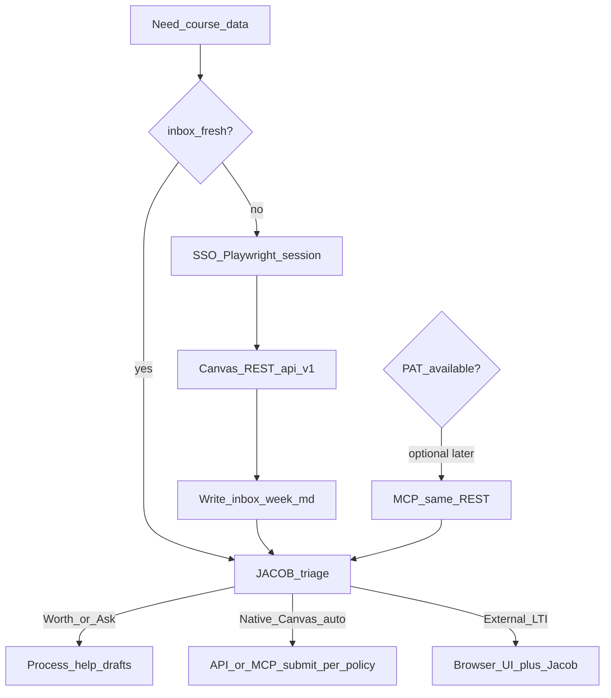

# Architecture — one truth path (Jacob IBE)

**One sentence:** Canvas REST is the truth; SSO/Playwright is how we reach it at CU without a PAT; `inbox/` is memory; browser UI is the exception path for LTI/external tools.

Do **not** treat “token MCP” and “Playwright” as equal peer products.

```text
JACOB.md triage              ← always the brain
        ↑
   inbox/ markdown           ← durable cache (agent reads every turn)
        ↑
   Canvas /api/v1 REST       ← single source of due/grade/assignment facts
     ↳ auth A: PAT + MCP     (optional, when OIT grants a token)
     ↳ auth B: SSO cookies   (Playwright / Cursor — default today)
        ↑
   Browser UI escape hatch   ← WebAssign, ZyBooks, PlayPosit, proctored, LTI
```

## Agent operating order (no PAT assumed)

1. Read [`JACOB.md`](../JACOB.md).
2. Prefer fresh [`inbox/week.md`](../inbox/week.md) (and `inbox/courses/*`).
3. If inbox missing or `Updated:` older than **2 days** → refresh with SSO sync:
   ```bash
   cd browser && npm run open-canvas   # once / when session dies
   cd browser && npm run sync          # writes inbox/week.md + inbox/courses/* catalogs via /api/v1
   ```
4. Triage Worth / Agent / Ask. When Jacob asks what’s next / priority: run `jacob-task-brief` (P0–P3). When Jacob names a **course**: run `jacob-course-arc` (theme + learning arc + class priority). Never auto WebAssign/ZyBooks/PlayPosit/proctored quizzes.
5. If/when `CANVAS_API_TOKEN` works: prefer MCP tools for the **same** facts and for native Canvas submits (preview→confirm). Still refresh inbox periodically so offline turns work.



## Layer details

### Brain — `JACOB.md`

Triage, course defaults, calibration (`.jacob/calibrated-courses.md`), priority rubric (`.jacob/priority-rubric.md`). Unchanged by auth method.

### Memory — `inbox/`

| Path | Purpose |
|------|---------|
| `inbox/week.md` | Canonical due list for the agent |
| `inbox/focus.md` | Optional dated Top-3 cache from `jacob-task-brief` (not a second due-list) |
| `inbox/courses/*.md` | Per-course notes + assignment catalog + checkpoints (sync) + arc notes (agent) + **instructor profile** (agent) |
| `inbox/audit-*.md` | Occasional deep sync reports |

Skills read inbox first when PAT is absent.

### Truth — Canvas `/api/v1`

Filled by:

| Auth | How |
|------|-----|
| **SSO (default)** | `browser/npm run sync` — session cookies → planner + todo + assignments + discussions + calendar (canonical `inbox/week.md`); `npm run audit` for 45d actionable-miss metrics |
| **PAT (optional)** | `CANVAS_API_TOKEN` + `canvas-mcp-server` MCP tools |

Same endpoints. Same facts. Different credential.

### Due dates — one timezone, two display formats

Canvas stores `due_at` in **UTC**. Both auth paths convert to **America/Denver (MT)** for Jacob-facing output, but the string shape differs:

| Path | Where | Example |
|------|--------|---------|
| **SSO sync → inbox** | `inbox/week.md` Due column; course catalog Due cells | `Thu, Aug 27, 2026, 11:59 PM MT` |
| **MCP (optional PAT)** | Tool responses via `format_date()` | `2026-08-27T23:59:00-06:00` |

Both mean the same wall clock. CU 11:59 PM MT deadlines often appear as `05:59` UTC on the **next** calendar day — do not use the UTC date as the due day. Agents quote **Denver local** only. Internal sort/window logic stays on ISO UTC.

### Escape hatch — Browser UI + CampusGroups

Only when REST cannot complete the work:

- WebAssign, ZyBooks, PlayPosit, other LTI
- **CampusGroups** (COEN major dinner, AI lab workshop) — Playwright `browser/.auth` scripts; see [`CU_BROWSER.md`](CU_BROWSER.md)
- Remotely proctored / lockdown quizzes
- Anything Jacob must perform live

Never auto-drive LTI/proctored tools. CampusGroups RSVP uses Playwright only (not Cursor IDE browser). Process help + verified RSVP; Jacob confirms calendar-binding slots.

## Instructor preferences (two tracks)

Professor preferences affect assignment completion in **two parallel tracks** — agents must consult both before drafts or auto-submit:

| Track | Storage | Used for |
|-------|---------|----------|
| **Draft format / policy** | `## Instructor profile` in `inbox/courses/CODE.md` (agent-maintained via `jacob-instructor-profile`) | Tone expectations, formatting, rubric habits, per-type notes; **AI policy = Jacob-written only** (`### AI policy (Jacob only)`) |
| **Jacob sound** | [`.jacob/writing-voice.md`](../.jacob/writing-voice.md) + [`.jacob/writing-samples/`](../.jacob/writing-samples/) | How drafts should sound (genre knobs); load after instructor profile |
| **Submit permission** | `agent_writes:` in Canvas syllabus → synced to `## Syllabus / agent policy notes` + enforced by MCP `course_policy.py` | Native Canvas auto-submit only |
| **Jacob trust** | `.jacob/calibrated-courses.md` | First-submit / auto-submit gate per course |

Profile informs draft format; writing-voice informs Jacob’s voice; syllabus marker + calibration gate submits. Profile **never** overrides quiz/LTI/proctored rules.

### Syllabus-first course catalog

Course MD files are filled **syllabus first**, then catalog inference:

```text
npm run sync → jacob-syllabus-intake → jacob-instructor-profile → course-arc / triage
```

1. **Sync** writes `inbox/courses/_raw/CODE-syllabus.txt` from Canvas `syllabus_body`. When that body is a stub, sync also fetches syllabus/grading/policy **pages** and syllabus-named **PDF files** (plus local `_raw/CODE-syllabus.pdf` when present) and merges them into the same `_raw` file. Hash in the course MD header detects changes.
2. **`jacob-syllabus-intake`** digests `_raw` into agent-owned sections: `## Syllabus sources`, `## Theme`, `## Modules / what's next`, and tightens Confidence/gaps. Checklist: weights, honor/exams (agent), formats, attendance, office hours, LTI/materials, section notes, hard deadlines. **AI allow/prohibit: never paste** — note `AI policy in syllabus — Jacob to fill manually` under Confidence gaps only.
3. **`jacob-instructor-profile`** rebuilds draft-voice preferences from that digest (syllabus tags dominate catalog inference). Preserves Jacob-written `### AI policy (Jacob only)`; never copies syllabus AI restriction rules.
4. Validate: `cd browser && npm run validate-profiles && npm run validate-course-md` — flags Theme still `(inferred)` when a non-stub `_raw` exists, missing `## Syllabus sources`, and thin `(syllabus)` tagging.

Re-intake when `Syllabus hash` changes, photo intake classifies `syllabus_delta`, or a policy announcement contradicts the profile. Stub courses (e.g. BCOR classic syllabus, ECON none) stay `(inferred)` until Jacob uploads a PDF or sync finds module pages.

After sync: rebuild stale profiles with `jacob-instructor-profile`; stamp Sources with `npm run refresh-profiles`.

## What not to build

- Two disagreeing systems of record (MCP world vs Playwright world)
- DOM scraping as the primary due-list source (API-via-SSO first)
- Stalling the agent on a missing PAT
- Storing IdentiKey passwords; committing `browser/.auth/`
- Headless MFA bypass

## Related

- [`CU_BROWSER.md`](CU_BROWSER.md) — login + sync commands  
- [`CU_ACCESS.md`](CU_ACCESS.md) — optional PAT when granted  
- [`browser/README.md`](../browser/README.md)
- Skill: [`skills/jacob-syllabus-intake/SKILL.md`](../skills/jacob-syllabus-intake/SKILL.md)
