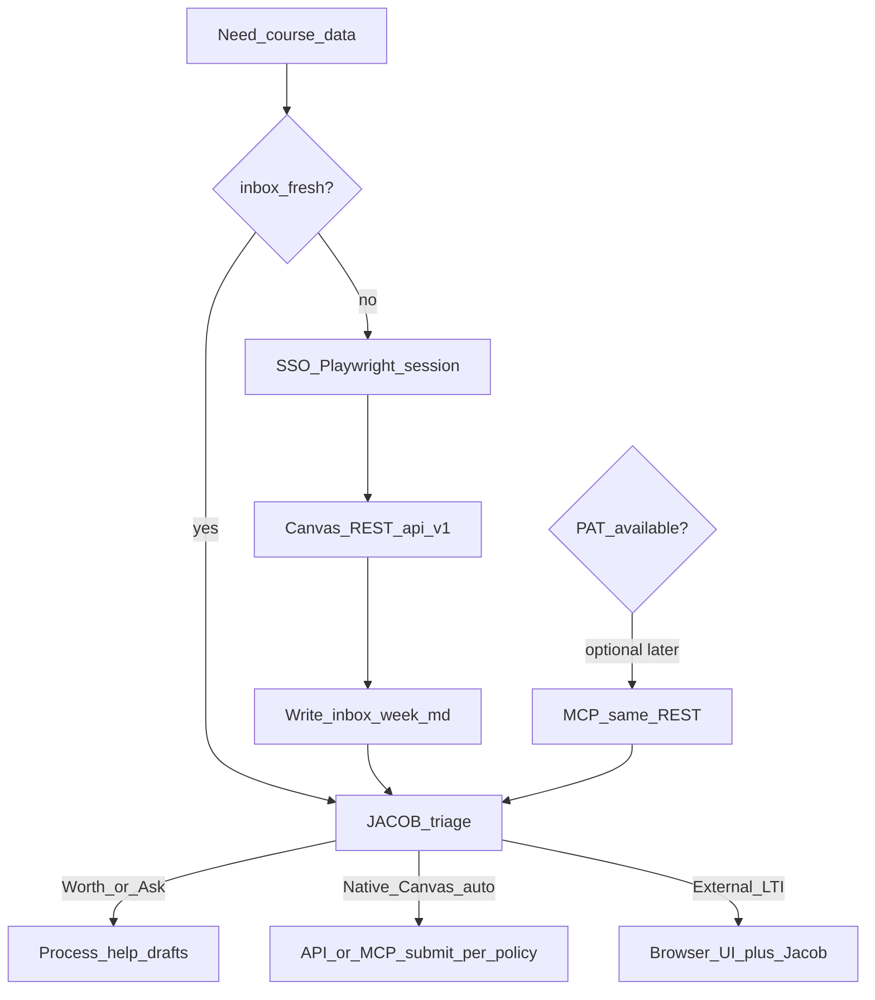

# Architecture — one truth path (Jacob IBE)

**One sentence:** Canvas REST is the truth; SSO/Playwright is how we reach it at CU without a PAT; `inbox/` is memory; browser UI is the exception path for LTI/external tools.

Do **not** treat “token MCP” and “Playwright” as equal peer products.

```text
JACOB.md triage              ← always the brain
        ↑
   inbox/ markdown           ← durable cache (agent reads every turn)
        ↑
   Canvas /api/v1 REST       ← single source of due/grade/assignment facts
     ↳ auth A: PAT + MCP     (optional, when OIT grants a token)
     ↳ auth B: SSO cookies   (Playwright / Cursor — default today)
        ↑
   Browser UI escape hatch   ← WebAssign, ZyBooks, PlayPosit, proctored, LTI
```

## Agent operating order (no PAT assumed)

1. Read [`JACOB.md`](../JACOB.md).
2. Prefer fresh [`inbox/week.md`](../inbox/week.md) (and `inbox/courses/*`).
3. If inbox missing or `Updated:` older than **2 days** → refresh with SSO sync:
   ```bash
   cd browser && npm run open-canvas   # once / when session dies
   cd browser && npm run sync          # writes inbox/week.md via /api/v1
   ```
4. Triage Worth / Agent / Ask. Never auto WebAssign/ZyBooks/PlayPosit/proctored quizzes.
5. If/when `CANVAS_API_TOKEN` works: prefer MCP tools for the **same** facts and for native Canvas submits (preview→confirm). Still refresh inbox periodically so offline turns work.



## Layer details

### Brain — `JACOB.md`

Triage, course defaults, calibration (`.jacob/calibrated-courses.md`). Unchanged by auth method.

### Memory — `inbox/`

| Path | Purpose |
|------|---------|
| `inbox/week.md` | Canonical due list for the agent |
| `inbox/courses/*.md` | Per-course notes |
| `inbox/audit-*.md` | Occasional deep sync reports |

Skills read inbox first when PAT is absent.

### Truth — Canvas `/api/v1`

Filled by:

| Auth | How |
|------|-----|
| **SSO (default)** | `browser/npm run sync` — session cookies → planner + todo + per-course assignments |
| **PAT (optional)** | `CANVAS_API_TOKEN` + `canvas-mcp-server` MCP tools |

Same endpoints. Same facts. Different credential.

### Escape hatch — Browser UI

Only when REST cannot complete the work:

- WebAssign, ZyBooks, PlayPosit, other LTI
- Remotely proctored / lockdown quizzes
- Anything Jacob must perform live

Never auto-drive these. Process help + Jacob clicks.

## What not to build

- Two disagreeing systems of record (MCP world vs Playwright world)
- DOM scraping as the primary due-list source (API-via-SSO first)
- Stalling the agent on a missing PAT
- Storing IdentiKey passwords; committing `browser/.auth/`
- Headless MFA bypass

## Related

- [`CU_BROWSER.md`](CU_BROWSER.md) — login + sync commands  
- [`CU_ACCESS.md`](CU_ACCESS.md) — optional PAT when granted  
- [`browser/README.md`](../browser/README.md)
