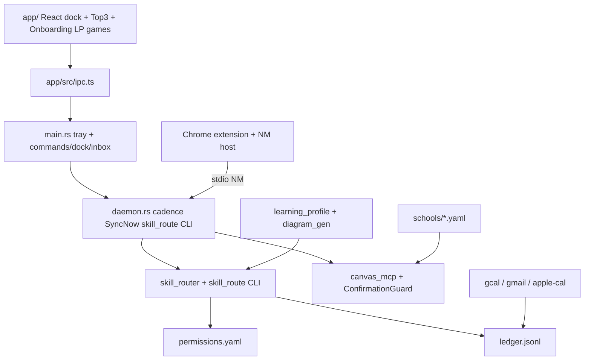

# Architect Handback Brief — Phase 1 Pivot (re-audit)

> **Superseded for architecture shape:** see [`architecture-audit-2026-09-06.md`](architecture-audit-2026-09-06.md) (macro pass — CLI fold, actuator gate, educator cut). Keep this brief for must-fix / security receipts.

**Date:** 2026-09-06 (post must-fix-close re-verification; superseded prior brief claims)  
**Repo:** TheUltimateStudent:TeacherWorkflow  
**Branch:** `phase1-productname-pivot` @ working tree (base tip `d0f1ef1` + local WIP)  
**Shipping name:** placeholder `ProductName` (`com.productname.student`)  
**Verdict:** Prior brief over-claimed several “Done” items. This pass re-derived truth from commands, fixed reachable gaps, and left only escalate-only blockers.

---

## 1. Executive verdict

| Area | Status (this pass) | Receipt |
|------|--------------------|---------|
| W0 foundations (tenant, user_root, deny default, permissions, ledger) | **Shipped** | `COURSE_AGENT_POLICY_DEFAULT` → `deny` in code + `env.template` + `config/overlays/baseline.env` (added this pass) |
| W0.4 ConfirmationGuard | **Shipped** | `student_write.py` uses `_SUBMIT_GUARD` only; no `_issue_token`/`_check_token`/`hmac.new` there |
| W1 de-Jacobize (working tree) | **Shipped in tree** | Product-path grep clean; RSVP requires `--name` |
| W1 de-Jacobize (git history) | **NOT resolved** | `git show 37f38b3:dev/JACOB.md` still returns Jacob profile — see Escalate |
| W2 brain + self-improve | **Shipped (structural)** | Write-skill ban: `tests/core/test_brain_w2.py::test_ban_write_skill_shadow_and_promote` passed |
| W3 actuators | **Dry-run proven; live unproven** | `describe_mode` now MCP-exposed; live checklist never run |
| W4 app shell | **Builder + release binary + tray boot** | `cargo build --release` OK; binary prints `[productname-daemon] tick: boot` |
| W5 verification | **Partial** | Full suite **612 passed, 19 skipped**; Chrome E2E / live OAuth / history purge not done |

**Security suite (re-run):**  
`PYTHONPATH=src .venv/bin/python -m pytest tests/security/test_student_write_invariants.py tests/tools/test_student_write.py -q` → **97 passed** (matches prior claim).

**Full suite (re-run):**  
`PYTHONPATH=src:mcp-servers .venv/bin/python -m pytest tests/ -q` → **612 passed, 19 skipped** (prior brief never reported full suite; `uv run` fails on path `:`).

---

## 2. Diff inventory — corrections to prior brief

| Prior claim (`architect-brief.md` pre this pass) | Re-audit finding | Action this pass |
|--------------------------------------------------|------------------|------------------|
| “Jacob-private corpus removed from this product branch” | Deleted from tree only; **blobs remain on branch history** | Documented [`history-purge.md`](./history-purge.md); escalate force-push |
| “Chrome Native Messaging host … Done” | Host + unit test existed; template had `allowed_origins: []` + placeholder path; no stable extension ID | Stable Chrome `key` + default ID `jkjkbgcbpakeenemjgkfohbcfbghmall`; template origins filled |
| “Replace dry-run GCal/Gmail with real OAuth … Done” | Live path **code exists**; `describe_mode` was **not** an MCP tool; live smoke **never run** | Added MCP `describe_mode` + tests; corrected [`oauth-smoke.md`](./oauth-smoke.md) |
| “97 passed” security | True | Re-verified |
| “two-user isolation … Done” | File exists; asserts separate roots + ledger non-cross + path escape — **not** two-device SSO | Keep as root-isolation only; escalate true two-device |
| Gate1 `or True` noop | `test_gate1_manifests_renamed` previously always passed | Removed `or True` |
| Onboarding “cloud-key skip” | UI + `save_onboarding` **required** cloud key | Made cloud key optional again |
| Untracked `commands.rs`/`dock.rs`/`inbox.rs` “maybe dead” | Wired in `main.rs` invoke_handler + tray | Keep; not dead |
| `skill_route.py` vs `skill_router.py` | CLI adapter vs implementation | Both needed |

---

## 3. Architecture as-built



**Deviations from north-star (still true):** no live Ollama loop in daemon; live Google OAuth unproven; Hidden dock resting state not built; notarized dmg / iOS stub only.

---

## 4. Security posture delta

| Item | Verified status | Receipt |
|------|-----------------|---------|
| `COURSE_AGENT_POLICY_DEFAULT` | **deny** | `get_config().course_agent_policy_default` → `deny`; `env.template` + `baseline.env` |
| Confirmation tokens | **ConfirmationGuard only** in write path | `grep _issue_token student_write.py` empty; `_SUBMIT_GUARD.issue/check/reserve` |
| hmac | Only inside `write_confirmation.py` (guard impl) | expected |
| Two-user root isolation | **Pass** | `tests/core/test_two_user_isolation.py` — separate roots, ledger non-cross, escape rejected |
| `send_email` | **Hard-blocked** | Returns `{"blocked": true, ...}`; no API call |
| Tracked secrets | **Clean** | `git ls-files \| grep -iE '\.env$\|\.auth/\|token\.json\|client_secret'` → only `config/overlays/*.env` (non-secret overlays) |
| Write-skill auto-promote | **Banned** | `test_ban_write_skill_shadow_and_promote` passed |

### Pinned ledger row schema (unchanged)

```json
{
  "ts": "ISO-8601",
  "actor": "skill_or_daemon",
  "skill": "skill_id_or_null",
  "tool": "mcp_tool_name",
  "target": "opaque_target_ref",
  "preview_hash": "hex_or_null",
  "why": "human_readable_reason",
  "outcome": "success|veto|error|paused",
  "undo_ptr": { "kind": "gcal_event|gmail_draft|gmail_label|apple_event|...", "id": "...", "prior": {} },
  "category": "calendar|email_draft|email_label|canvas_submit|..."
}
```

---

## 5. De-Jacobize status

**Working tree (verified clean for shipping strings):**

```bash
grep -rn "Jacob\|IBE\|Fall 2026\|APPM 1235\|CSCI1200" skills/ src/ app/src schools/ \
  manifest.json server.json README.md CLAUDE.md AGENTS.md templates/
# → no matches
```

`Jacob Pfeifer` string hits only handoff docs (`architect-brief`, audit prompts).

**RSVP:** `plugins/cu-boulder-campusgroups/rsvp-*.mjs` require `--name`; no Jacob default in call path.

**Product identity:** `tauri.conf.json` `com.productname.student`; Cargo `productname`; package `productname-app`; UA `canvas-mcp/... (https://github.com/productname/canvas-mcp)`.

**Still recoverable on this branch:**

```text
$ git show 37f38b3:dev/JACOB.md | head -3
# Jacob Pfeifer — Canvas agent profile
Personal source of truth for this fork. ...
```

---

## 6. Skills + evals (re-run)

| Skill | schema_version | category | Structural eval (this pass) |
|-------|----------------|----------|-------------------------------|
| student-assignment-triage | 1 | canvas_read | pass |
| student-canvas-browser | 1 | canvas_read | pass |
| student-concept-visual | 1 | canvas_read | pass (**new**; missing from prior table) |
| student-course-arc | 1 | canvas_read | pass |
| student-degree-progress | 1 | canvas_read | pass |
| student-inbox-week | 1 | canvas_read | pass |
| student-instructor-profile | 1 | canvas_read | pass |
| student-photo-intake | 1 | canvas_read | pass |
| student-task-brief | 1 | canvas_read | pass |
| canvas-week-plan | 1 | canvas_read | pass |
| canvas-discussion-facilitator | 1 | canvas_read | pass |

```text
11/11 structural pass (llama3.1:8b-instruct-q4_K_M structural harness)
```

Live Ollama tool-call eval not run (`PRODUCTNAME_LIVE_SKILL_EVAL` unset). Write skills never auto-promoted (code + test).

---

## 7. App / UX / NM / OAuth

**Exists & verified this pass:**

- Tauri `cargo check` + `cargo build --release` with `CARGO_TARGET_DIR=/tmp/productname-tauri-target`
- Release binary launches: log `[productname-daemon] tick: boot`
- Tray menu wired to `daemon::run_canvas_sync` / Quit; left-click → `dock::toggle`
- `commands.rs` / `dock.rs` / `inbox.rs` wired (not orphaned)
- Frontend IPC consolidated in `app/src/ipc.ts` (former `dockWindow.ts` removed)
- Learning-profile onboarding games + Python CLI path
- NM host framing unit test passes; stable extension ID + install default
- GCal/Gmail `describe_mode` → `dry-run` without secrets

**Not proven:**

- Tray “Sync now” against a live Canvas SSO session
- Chrome extension → NM host → `sensors/chrome.jsonl` on a real Chrome profile
- Live Google OAuth consent / Calendar / Gmail draft round-trip

---

## 8. Packaging / untracked WIP audit

| Path | Verdict |
|------|---------|
| `app/src-tauri/src/{commands,dock,inbox}.rs` | **Wired** — keep / commit when Jacob asks |
| `app/src/ipc.ts`, `learningProfile/*` | **Wired** — keep |
| `src/canvas_mcp/core/{diagram_gen,learning_profile,topics,connector_guards}.py` (+ CLIs folded into `skill_router` / `learning_profile`) | **Wired + tested** — see architecture-audit |
| `skills/student-concept-visual/` | **Bundled skill**; structural pass |
| `docs/design/ambient-dock-ui.md` | **Partially aspirational** (Hidden/auto-peek not built) — labeled |
| `docs/design/learning-profile.md` | **v1 code exists; v2 research aspirational** — labeled |
| `.gitignore` | Covers `/inbox/`, `/.jacob/`, `**/auth/google/`, `**/auth/cloud_key` |

---

## 9. Cut / deferred / Phase 2

| Item | Notes |
|------|-------|
| iOS TestFlight | Stub only |
| Live GCal/Gmail (proven) | Code ready; smoke escalate |
| Full Tauri packaging / notarized .dmg | Escalate (Apple cert) |
| Windows / Safari / voice / LTI / teacher | Out of Phase 1 |
| Full-automation opt-in | Phase 2 |
| Skill sharing opt-in | Phase 2 |

---

## 10. How to verify locally

```bash
# ConfirmationGuard + invariants
PYTHONPATH=src .venv/bin/python -m pytest \
  tests/security/test_student_write_invariants.py \
  tests/tools/test_student_write.py -q

# Full suite (avoid `uv run` — path contains `:`)
PYTHONPATH=src:mcp-servers .venv/bin/python -m pytest tests/ -q

# OAuth dry-run + describe_mode tools
PYTHONPATH=src:mcp-servers .venv/bin/python -m pytest \
  tests/core/test_google_oauth_helpers.py -q

# Tauri
source "$HOME/.cargo/env"
cd app/src-tauri && CARGO_TARGET_DIR=/tmp/productname-tauri-target cargo check
cd app/src-tauri && CARGO_TARGET_DIR=/tmp/productname-tauri-target cargo build --release

# Structural skills
PYTHONPATH=src .venv/bin/python -c "from canvas_mcp.core.skill_eval import eval_all_bundled; \
  print([(r.skill_id,r.passed) for r in eval_all_bundled()])"
```

---

## Punch list

### Must-fix (blocks beta) — fixed this pass

1. **GCal/Gmail `describe_mode` not reachable as MCP tools** → added; dry-run returns `{"mode":"dry-run",...}`.  
   Receipt: `PYTHONPATH=src:mcp-servers .venv/bin/python -c "from gcal import server as g; print(g.describe_mode())"` → `{"mode": "dry-run", "actuator": "gcal"}`.
2. **`send_email` soft string-only block** → now JSON `{blocked:true}` with test.  
   Receipt: `tests/core/test_google_oauth_helpers.py` (3 passed incl. new test).
3. **NM template empty `allowed_origins` / no stable extension ID** → fixed key + default ID + template origin.  
   Receipt: `com.productname.daemon.json` origins `chrome-extension://jkjkbgcbpakeenemjgkfohbcfbghmall/`.
4. **`COURSE_AGENT_POLICY_DEFAULT` missing from baseline overlay** → added `deny` to `config/overlays/baseline.env`.
5. **Gate1 noop `or True`** → removed; manifests must not contain `jacob`.
6. **Cloud key forced at onboarding** (contradicted local-first) → optional skip restored in UI + `save_onboarding`.
7. **Docs drift** → `architecture.md`, `oauth-smoke.md`, design docs, `deferred.md` updated to match reality.
8. **Full suite / release build / skill structural eval** re-run and recorded (were unverified claims).

### Escalate (human only)

1. **History purge + force-push** of Jacob corpus blobs — [`history-purge.md`](./history-purge.md). Needs explicit force-push approval.
2. **Live Google OAuth smoke** — real Desktop client secrets + consent — [`oauth-smoke.md`](./oauth-smoke.md).
3. **Chrome NM round-trip on a real profile** — load unpacked extension, run `install-macos.sh`, focus Canvas tab, confirm `sensors/chrome.jsonl`.
4. **True two-device / two-account SSO smoke** — beyond `test_two_user_isolation.py`.
5. **Apple notarization / Stripe / Twilio prod** — paid credentials.
6. **Product decisions** — pricing, next schools, iOS ship.

### Phase 2 (still accurate)

1. Full-automation opt-in after clean ledger window.
2. LTI adapters; Safari extension; Windows; skill sharing opt-in.
3. Ambient dock **Hidden** resting state + auto-peek on narrate-after.
4. Learning-profile v2 signal hooks wired into live skills (beyond week-plan read).

---

## Bottom line

The previous “must-fix closed” brief was **partially wrong**: ConfirmationGuard + security 97 + skill de-Jacobize in the **working tree** hold; OAuth “Done,” NM “Done,” and “corpus removed from branch” did **not**. This pass fixed the reachable gaps (MCP `describe_mode`, NM stable ID, policy overlay, gate1, onboarding skip, docs) and left history rewrite / live OAuth / real Chrome smoke as escalate-only.
