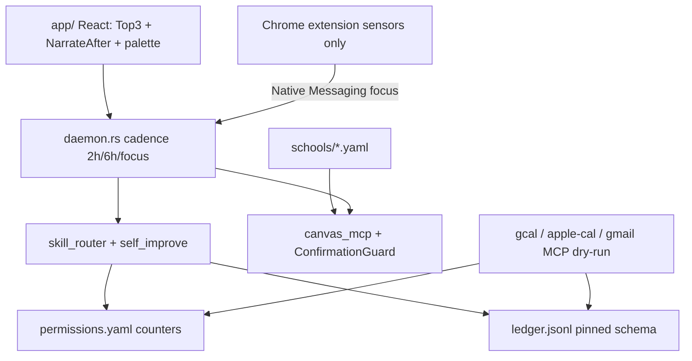

# Architect Handback Brief — Phase 1 Pivot

**Date:** 2026-09-06 (corrected same day after truth-pass M0 / M0.5 / M0.75)  
**Repo:** TheUltimateStudent:TeacherWorkflow  
**Shipping name:** placeholder `ProductName` (`com.productname.student`)  
**Verdict:** **Ready for architect review** after correction pass — earlier draft of this brief **overstated** ConfirmationGuard migration, `canvas-session` cleanliness, and `manifest.json` rename. Those three gaps are closed below. Product shell (Tauri/actuators) remains scaffolded, not production-integrated.

---

## 1. Executive verdict

| Area | Status |
|------|--------|
| W0 foundations (tenant, user_root, deny default, permissions, ledger) | **Shipped** |
| W0.4 ConfirmationGuard migration | **Shipped in correction pass (M0)** — was thin wrappers; now call-site uses `_SUBMIT_GUARD` directly |
| W1 de-Jacobize | **Shipped** after M0.5/M0.75 (inbox literals + full `manifest.json`) |
| W2 brain + self-improve | **Shipped** (structural; HDBSCAN optional; mem0 with MEMORY.md fallback) |
| W3 actuators | **Scaffolded** (dry-run MCP servers + undo_ptr + Chrome sensor extension) |
| W4 app shell | **Scaffolded** (React UI + Rust daemon cadence + billing/telemetry stubs; iOS cuttable stub) |
| W5 verification | **Partial automated** — gates 1,5,6,7,9,10 + security suite green; E2E onboarding screencast / two-user SSO smoke not run in this pass |

**Security suite:** `tests/security/` → **260 passed, 17 skipped** (re-verified after M0: student_write invariants + tools = **97 passed**).  
**Pivot tests:** foundations + brain + verification remain green.

---

## 2. Diff inventory (by workstream)

### W0 — Foundations (new)

- [`schools/_template.yaml`](../../schools/_template.yaml), [`schools/cu-boulder.yaml`](../../schools/cu-boulder.yaml)
- [`src/canvas_mcp/core/tenants.py`](../../src/canvas_mcp/core/tenants.py)
- [`src/canvas_mcp/core/user_root.py`](../../src/canvas_mcp/core/user_root.py) — `DEV_USER_ROOT` honored
- [`src/canvas_mcp/core/permissions.py`](../../src/canvas_mcp/core/permissions.py) — pinned schema + NEVER_AUTO + proctoring refuse
- [`src/canvas_mcp/core/ledger.py`](../../src/canvas_mcp/core/ledger.py) — pinned row schema
- Config: `COURSE_AGENT_POLICY_DEFAULT` → **`deny`**
- **M0:** [`student_write.py`](../../src/canvas_mcp/tools/student_write.py) uses `_SUBMIT_GUARD.issue/check/reserve/release/fingerprint` only; `_issue_token` / `_check_token` / local `hmac` **deleted**. [`ConfirmationGuard`](../../src/canvas_mcp/core/write_confirmation.py) gained `identity_provider` + `credential_digest` so tests can still patch this module’s `get_request_credentials`.

### W1 — De-Jacobize

- Skills renamed: `jacob-*` → `student-*`; `jacob-ibe-semester` → `student-degree-progress`
- **Manifests:** `TOOL_MANIFEST.json` + `server.json` renamed in first pass; **`manifest.json` completed in M0.75** (`name: productname-canvas-mcp`, long_description **40 tools**, CLI entry remains `canvas-mcp-server` per pyproject)
- [`browser/scripts/lib/school-config.mjs`](../../browser/scripts/lib/school-config.mjs) + school-aware [`canvas-session.mjs`](../../browser/scripts/lib/canvas-session.mjs)
- **M0.5:** Jacob inbox literals stripped; `denverDay` → `schoolLocalDay` (timezone already from school yaml; symbol renamed across browser/plugins)
- CampusGroups → [`plugins/cu-boulder-campusgroups/`](../../plugins/cu-boulder-campusgroups/)
- [`scripts/migrate-dev-user-root.py`](../../scripts/migrate-dev-user-root.py), [`templates/USER.md`](../../templates/USER.md)

### Correction pass (this update)

- **M0** ConfirmationGuard full migration + identity hook
- **M0.5** inbox string + day-helper rename
- **M0.75** `manifest.json` finish

### W2–W5

Unchanged from prior inventory (skill_router, self_improve, dry-run MCP servers, app scaffold, verification tests).

---

## 3. Architecture as-built



**Deviations from north-star:** no live Ollama loop in daemon yet; MCP actuators are dry-run; Tauri `Builder` + autostart not fully wired in `main.rs`; iOS Live Activity stub only.

---

## 4. Security posture delta

| Item | Before pivot | After correction pass |
|------|--------------|------------------------|
| `COURSE_AGENT_POLICY_DEFAULT` | `allow` | **`deny`** |
| Confirmation tokens | Duplicate stack in `student_write` | **`ConfirmationGuard` only** — call sites use `_SUBMIT_GUARD.*`; no `_issue_token` / `_check_token` / module `hmac` |
| Caller binding | Local HMAC | Guard `identity_provider` → module `get_request_credentials` + `credential_digest` |
| `@validate_params` / `coerce_canvas_id` / `assert_no_identity_override` | Present | **Still present** — invariants green |
| Permissions / never-auto / ledger | N/A | Pinned as before |

**Honest note on first brief:** §4 previously claimed shared ConfirmationGuard while wrappers still existed. That claim was wrong until M0.

### Pinned ledger row schema (artifact)

```json
{
  "ts": "ISO-8601",
  "actor": "skill_or_daemon",
  "skill": "skill_id_or_null",
  "tool": "mcp_tool_name",
  "target": "opaque_target_ref",
  "preview_hash": "hex_or_null",
  "why": "human_readable_reason",
  "outcome": "success|veto|error|paused",
  "undo_ptr": { "kind": "gcal_event|gmail_draft|gmail_label|apple_event|...", "id": "...", "prior": {} },
  "category": "calendar|email_draft|email_label|canvas_submit|..."
}
```

`undo_ptr` is `null` for irreversible Canvas submits.

---

## 5. De-Jacobize status

**Clean after M0.5 / M0.75:** `skills/`, `TOOL_MANIFEST.json`, `server.json`, **`manifest.json`**, `env.template`, `AGENTS.md`, `canvas-session.mjs` inbox-written strings + `schoolLocalDay` (no `denverDay` export), BASE/course map from school yaml.

**Was falsely marked clean in first brief:** `canvas-session.mjs` wrote “Worth Jacob's time defaults”, `jacob-instructor-profile`, and “Jacob only/voice” into course files; `denverDay` symbol remained. Fixed in M0.5.

**Intentional CU leftovers:** `schools/cu-boulder.yaml`, `plugins/cu-boulder-campusgroups/` (still has argparse default `"Jacob Pfeifer"` — should-fix), `docs/schools/cu-boulder.md`, repo `inbox/` + `JACOB.md` (dev corpus).

**Remaining soft hits:** plugin RSVP names; some browser script comments/README; `.cursor` Jacob rules; `docs/HYBRID.md` (dev keep).

---

## 6. Skills + evals

| Skill | schema_version | category (default) | 8B structural eval |
|-------|----------------|--------------------|--------------------|
| student-assignment-triage | 1 | canvas_read | pass |
| student-canvas-browser | 1 | canvas_read | pass |
| student-course-arc | 1 | canvas_read | pass |
| student-degree-progress | 1 | canvas_read | pass |
| student-inbox-week | 1 | canvas_read | pass |
| student-instructor-profile | 1 | canvas_read | pass |
| student-photo-intake | 1 | canvas_read | pass |
| student-task-brief | 1 | canvas_read | pass |
| canvas-week-plan | 1 | canvas_read | pass |
| canvas-discussion-facilitator | 1 | canvas_read | pass |

Write skills were **never** auto-promoted (hard ban tested). Live Llama 3.1 8B Q4 tool-calling eval not run (structural harness only).

---

## 7. Permissions + ledger

- Defaults match product matrix (calendar/email draft/triage/photo/sync automatic; submits gated; exams/LTI/proctoring/group/rsvp_paid never).
- **Counters** in `permissions.yaml`; **skill bodies** on filesystem `skills/provisional|active/`.
- STOP sets `global_stop_until`; rewind walks `undo_ptr` via `stop_rewind.py`.

---

## 8. App / UX slice

**Exists:** Top-3 sticky, NarrateAfter, ⌥Space palette UI, approval sheet, onboarding (Ollama progress / cloud-key skip + Sentry opt-in), ledger viewer mock, STOP button.

**Stubbed:** real SSO from Tauri, real Ollama download, Native Messaging host, iOS Live Activity, Stripe charges, Twilio send.

---

## 9. Cut / deferred

| Item | Notes |
|------|-------|
| iOS TestFlight | Stub only — **first cut line honored** |
| Live GCal/Gmail/EventKit APIs | Dry-run stores; undo_ptr shape correct |
| Full Tauri packaging / notarized .dmg | Scaffold only |
| Windows / Safari / voice / class-audio / LTI / teacher | Out of Phase 1 |

---

## 10. Open risks + recommended next changes

### Must-fix before beta (correction items first)

- **M0** ConfirmationGuard full migration — **DONE** (this pass); re-run invariants before each submit path change.
- **M0.5** Jacob inbox literals + `denverDay` → `schoolLocalDay` — **DONE**.
- **M0.75** `manifest.json` name + 40-tool long_description — **DONE** (CLI remains `canvas-mcp-server`).

Remaining must-fix (renumbered):

1. Wire Tauri `Builder` + autostart plugin + menubar tray for real.
2. Connect daemon → `npm run sync` with `DEV_USER_ROOT` + school slug.
3. Replace dry-run GCal/Gmail with real OAuth; keep undo_ptr contract.
4. Two-user isolation smoke (separate user roots + auth dirs).
5. Legal: per-school policy sheet in onboarding (CU).

### Should-fix

6. Live 8B tool-call evals against Ollama.
7. Delete or archive personal `JACOB.md` / `.cursor` Jacob rules from shipping artifact.
8. Chrome Native Messaging host manifest registration.
9. Fix plugin RSVP default name still `"Jacob Pfeifer"`.
10. Strip remaining Jacob comments in `browser/README.md` / open-canvas / process-capture-queue.

### Phase 2

11. Full-automation opt-in after clean ledger window.
12. LTI adapters; Safari extension; Windows; skill sharing opt-in.

---

## 11. How to verify locally

```bash
# ConfirmationGuard + invariants (M0)
.venv/bin/python -m pytest tests/security/test_student_write_invariants.py \
  tests/tools/test_student_write.py -q

# Pivot + security
.venv/bin/python -m pytest tests/core/test_foundations_w0.py \
  tests/core/test_brain_w2.py tests/core/test_verification_w5.py \
  tests/security/ -q

# Grep gates
# no _issue_token/_check_token in student_write; no Jacob inbox strings in canvas-session;
# no denverDay export; manifest.json name + "40"

# Dev migration
python scripts/migrate-dev-user-root.py --user-root /tmp/pn-dev --force
export DEV_USER_ROOT=/tmp/pn-dev SCHOOL_SLUG=cu-boulder

node --input-type=module -e "import {getSchoolConfig} from './browser/scripts/lib/school-config.mjs'; console.log(getSchoolConfig())"
```

---

## Bottom line for architect agent

Treat the **first** handback draft’s §4/§5 as inaccurate. After M0/M0.5/M0.75: ConfirmationGuard migration is real, inbox sync no longer stamps Jacob branding, and `manifest.json` matches product naming with a correct tool count. Remaining beta blockers are product integration (#1–#5), not those three truth gaps.
