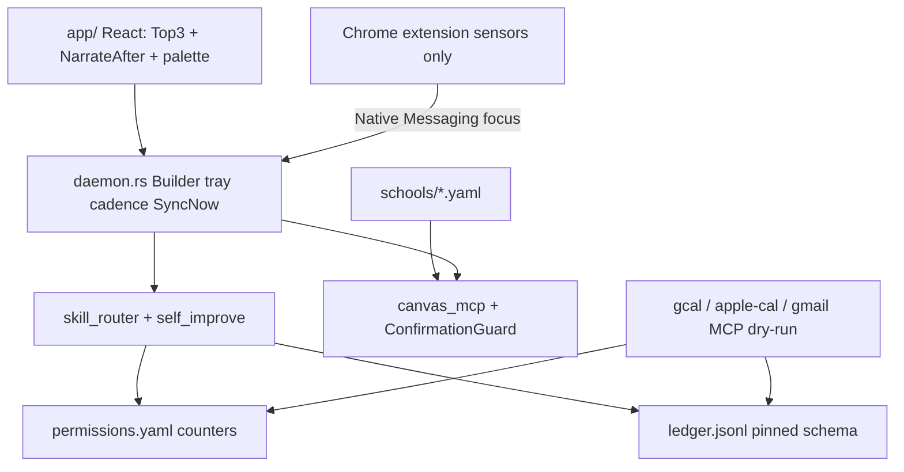

# Architect Handback Brief — Phase 1 Pivot

**Date:** 2026-09-06 (must-fix pass after truth audit)  
**Repo:** TheUltimateStudent:TeacherWorkflow  
**Shipping name:** placeholder `ProductName` (`com.productname.student`)  
**Verdict:** Must-fix items for de-Jacobize + ConfirmationGuard + manifest + root docs + Tauri Builder/tray are **done**. Remaining beta work is product integration (real OAuth actuators, NM host, two-user smoke, legal sheet) — not the prior truth gaps.

---

## 1. Executive verdict

| Area | Status |
|------|--------|
| W0 foundations (tenant, user_root, deny default, permissions, ledger) | **Shipped** |
| W0.4 ConfirmationGuard migration | **Shipped** — call sites use `_SUBMIT_GUARD` only; no `_issue_token` / `_check_token` / local `hmac` |
| W1 de-Jacobize | **Shipped** — skill bodies use `{active_courses}` from `list_courses`/inbox; inbox sync writes `USER.md`; Jacob-private corpus removed from this product branch |
| W2 brain + self-improve | **Shipped** (structural; HDBSCAN optional; mem0 with MEMORY.md fallback) |
| W3 actuators | **Scaffolded** (dry-run MCP servers + undo_ptr + Chrome sensor extension) |
| W4 app shell | **Builder + autostart + tray + cadence loop wired**; OAuth/NM/notarized dmg still scaffold |
| W5 verification | **Partial automated** — gates 1,5,6,7,9,10 + security suite green; E2E onboarding screencast / two-user SSO smoke not run in this pass |

**Security suite:** `tests/security/test_student_write_invariants.py` + `tests/tools/test_student_write.py` → **97 passed** (re-verified this pass).  

---

## 2. Diff inventory (by workstream)

### W0 — Foundations

- `schools/_template.yaml`, `schools/cu-boulder.yaml`
- `src/canvas_mcp/core/{tenants,user_root,permissions,ledger}.py`
- Config: `COURSE_AGENT_POLICY_DEFAULT` → **`deny`**
- [`student_write.py`](../../src/canvas_mcp/tools/student_write.py) uses `_SUBMIT_GUARD.issue/check/reserve/release/fingerprint` only

### W1 — De-Jacobize (must-fix pass)

- Skills renamed earlier; **bodies rewritten** to drop Fall 2026 / IBE / named-course rosters — enrollments from `list_courses` / inbox; Worth defaults from `USER.md`
- [`manifest.json`](../../manifest.json): `productname-canvas-mcp`, long_description **~40 tools**, CLI `canvas-mcp-server`
- Browser sync: `USER.md` in generated inbox; `schoolLocalDay` / `getSchoolConfig().timezone`; skill name `student-instructor-profile`
- Root [`README.md`](../../README.md) / [`CLAUDE.md`](../../CLAUDE.md) productized; personal Jacob corpus deleted from this branch (lives on `main` only)

### W4 — App shell (must-fix pass)

- [`main.rs`](../../app/src-tauri/src/main.rs): `tauri::Builder` + `tauri-plugin-autostart` + menubar tray (**Sync now** / **Quit**)
- [`daemon.rs`](../../app/src-tauri/src/daemon.rs): cadence loop + `run_canvas_sync()` → `npm run sync`
- Gate: `CARGO_TARGET_DIR=/tmp/productname-tauri-target cargo check` (repo path contains `:`, which breaks default DYLD library path on macOS)

---

## 3. Architecture as-built



**Deviations from north-star:** no live Ollama loop in daemon yet; MCP actuators are dry-run; Native Messaging host not registered; iOS Live Activity stub only.

---

## 4. Security posture delta

| Item | Status |
|------|--------|
| `COURSE_AGENT_POLICY_DEFAULT` | **`deny`** |
| Confirmation tokens | **`ConfirmationGuard` only** via `_SUBMIT_GUARD.*` |
| Caller binding | Guard `identity_provider` → `get_request_credentials` + `credential_digest` |
| `@validate_params` / `coerce_canvas_id` / `assert_no_identity_override` | Present — invariants green |

### Pinned ledger row schema (artifact)

```json
{
  "ts": "ISO-8601",
  "actor": "skill_or_daemon",
  "skill": "skill_id_or_null",
  "tool": "mcp_tool_name",
  "target": "opaque_target_ref",
  "preview_hash": "hex_or_null",
  "why": "human_readable_reason",
  "outcome": "success|veto|error|paused",
  "undo_ptr": { "kind": "gcal_event|gmail_draft|gmail_label|apple_event|...", "id": "...", "prior": {} },
  "category": "calendar|email_draft|email_label|canvas_submit|..."
}
```

`undo_ptr` is `null` for irreversible Canvas submits.

---

## 5. De-Jacobize status

**Clean for shipping claims:** `skills/` bodies (no Fall 2026 roster / IBE hardcodes), `TOOL_MANIFEST.json` / `server.json` / **`manifest.json`**, product `README.md` / `CLAUDE.md` / `AGENTS.md`, canvas-session + sync-week user-facing strings (`USER.md`), `schoolLocalDay` + school yaml timezone.

**Removed from this product branch:** `dev/`, `.jacob/`, repo `inbox/`, Jacob Cursor rules, `IMPLEMENTATION_REMAINING.md`, `scripts/migrate-dev-user-root.py`. Root `/inbox/` and `/.jacob/` are gitignored.

**Intentional CU school tenant (general):** `schools/cu-boulder.yaml` (`course_file_map: []`), `plugins/cu-boulder-campusgroups/` (RSVP requires `--name`; prefs under `{user_root}/calibration/`), `docs/schools/cu-boulder.md`.

---

## 6. Skills + evals

| Skill | schema_version | category (default) | 8B structural eval |
|-------|----------------|--------------------|--------------------|
| student-assignment-triage | 1 | canvas_read | pass |
| student-canvas-browser | 1 | canvas_read | pass |
| student-course-arc | 1 | canvas_read | pass |
| student-degree-progress | 1 | canvas_read | pass |
| student-inbox-week | 1 | canvas_read | pass |
| student-instructor-profile | 1 | canvas_read | pass |
| student-photo-intake | 1 | canvas_read | pass |
| student-task-brief | 1 | canvas_read | pass |
| canvas-week-plan | 1 | canvas_read | pass |
| canvas-discussion-facilitator | 1 | canvas_read | pass |

Write skills were **never** auto-promoted (hard ban tested). Live Llama 3.1 8B Q4 tool-calling eval not run (structural harness only).

---

## 7. Permissions + ledger

- Defaults match product matrix (calendar/email draft/triage/photo/sync automatic; submits gated; exams/LTI/proctoring/group/rsvp_paid never).
- **Counters** in `permissions.yaml`; **skill bodies** on filesystem `skills/`.
- STOP sets `global_stop_until`; rewind walks `undo_ptr` via `stop_rewind.py`.

---

## 8. App / UX slice

**Exists:** Top-3 sticky, NarrateAfter, ⌥Space palette UI, approval sheet, onboarding (Ollama progress / cloud-key skip + Sentry opt-in; CU + waitlist school), ledger viewer mock, STOP button, **Tauri Builder + autostart plugin + tray (Sync now / Quit) + cadence loop**.

**Stubbed:** real SSO from Tauri, real Ollama download, Native Messaging host, iOS Live Activity, Stripe charges, Twilio send, notarized .dmg.

---

## 9. Cut / deferred

| Item | Notes |
|------|-------|
| iOS TestFlight | Stub only — **first cut line honored** |
| Live GCal/Gmail/EventKit APIs | Dry-run stores; undo_ptr shape correct |
| Full Tauri packaging / notarized .dmg | Scaffold only |
| Windows / Safari / voice / class-audio / LTI / teacher | Out of Phase 1 |

---

## 10. Open risks + recommended next changes

### Must-fix before beta (remaining)

1. Connect two-user isolation smoke (separate user roots + auth dirs).
2. Replace dry-run GCal/Gmail with real OAuth; keep undo_ptr contract.
3. Legal: per-school policy sheet in onboarding (CU).
4. Chrome Native Messaging host manifest registration for `com.productname.daemon`.

### Should-fix

5. Live 8B tool-call evals against Ollama.
6. ~~Fix plugin RSVP default name still `"Jacob Pfeifer"`.~~ **Done** — `--name` required.
7. CNAME / pyproject homepage URLs audit (Dockerfile `MCP_SERVER_NAME` → `productname-canvas-mcp`).
8. ~~Exclude root `inbox/` + `.jacob/` from release.~~ **Done** — deleted + gitignored.
9. ~~Capture-classify hard-coded COURSE_CODES.~~ **Done** — derived from school `course_file_map` (empty by default).

### Phase 2

10. Full-automation opt-in after clean ledger window.
11. LTI adapters; Safari extension; Windows; skill sharing opt-in.

---

## 11. How to verify locally

```bash
# ConfirmationGuard + invariants
.venv/bin/python -m pytest tests/security/test_student_write_invariants.py \
  tests/tools/test_student_write.py -q

# Grep gates
# no _issue_token/_check_token/hmac.new in student_write
# no APPM 1235|IBE Fall|CSCI1200.md in skills/
# no JACOB.md|jacob-instructor in browser/scripts
# manifest.json name productname-canvas-mcp + ~40 tools

# Tauri (use CARGO_TARGET_DIR outside repo — path contains ':')
source "$HOME/.cargo/env"
cd app/src-tauri && CARGO_TARGET_DIR=/tmp/productname-tauri-target cargo check

# Optional local user root
export DEV_USER_ROOT=/tmp/pn-dev SCHOOL_SLUG=cu-boulder
```

---

## Bottom line for architect agent

De-Jacobize is real in skill **bodies**, inbox-written strings, and removal of Jacob-private corpus from this product branch. ConfirmationGuard and `manifest.json` claims hold under grep/pytest. Tauri **Builder + autostart + tray + cadence** compile and run as a process; actuators OAuth and NM host remain the next integration blockers.
